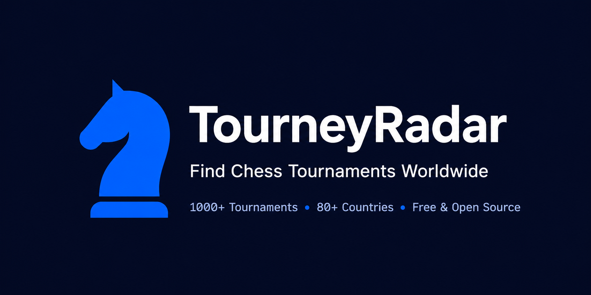
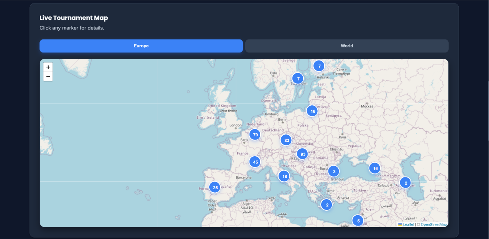
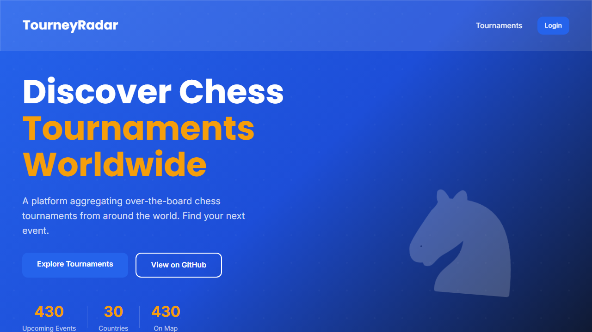

# TourneyRadar

<div align="center">



**Find chess tournaments happening near you and around the world.**

<a href="https://nextjs.org/"></a>
<a href="https://typescriptlang.org/"></a>
<a href="https://supabase.com/"></a>
<a href="https://tailwindcss.com/"></a>
<a href="https://vercel.com/"></a>
<a href="https://github.com/AnayDhawan/tourneyradar/actions/workflows/ci.yml"></a>
<a href="LICENSE"></a>
<a href="https://github.com/AnayDhawan/tourneyradar/stargazers"></a>

**[→ Live site: tourneyradar.com](https://www.tourneyradar.com)**

</div>

---

**TourneyRadar puts 1,100+ upcoming chess tournaments across 80+ countries on one interactive map, updated weekly.**

<!-- DEMO GIF: an animated walkthrough (filter by country → click a pin → open details) belongs here as docs/media/demo.gif. Tracked in a "good first issue" — contributions welcome. -->

Chess tournaments are scattered across Chess-Results.com, federation websites, and club newsletters. TourneyRadar puts them all in one place. Filter by country, time control, and FIDE rating status. No account needed.

---

## Feature Highlights

| | |
|---|---|
|  |  |
| **Interactive World Map** - All tournaments at a glance with clustered pins | **Paginated List** - Browse and search tournaments by country, format, rating |

---

## Key Features

### Map Experience
- **Interactive Leaflet map** with real-time tournament clusters
- Zoom to any region: Europe, Asia, Americas
- Click pins for instant tournament details
- No login required

### Filtering & Discovery
- Filter by **country, time control, FIDE rating status**
- Search tournaments by name, organizer, venue
- Upcoming tournaments sorted by date
- Discover new events in your region

### Tournament Details
- **Complete info**: venue, prize pool, time control, rounds, registration link
- Contact organizer via email or WhatsApp
- External links to Chess-Results and federation websites
- Tournament status (ongoing, completed, upcoming)

### Public Analytics
- Visit `/stats` for tournament frequency, popular formats, and regional breakdowns
- No authentication required
- Updated weekly as new tournaments are scraped

---

## Tech Stack

| Component | Technology |
|-----------|-----------|
| **Frontend** | Next.js 15, React 19, TypeScript |
| **Styling** | Tailwind CSS v4 |
| **Maps** | Leaflet + react-leaflet-cluster |
| **Backend** | Supabase (PostgreSQL) |
| **Data Pipeline** | Puppeteer scraper (GitHub Actions weekly) |
| **Deployment** | Vercel |

---

## Getting Started

### Prerequisites
- Node.js 20+
- npm or yarn

### Local Development

1. **Clone and install:**
   ```bash
   git clone https://github.com/AnayDhawan/tourneyradar.git
   cd tourneyradar
   npm install
   ```

2. **Set up environment variables:**
   ```bash
   cp .env.local.example .env.local
   ```
   Fill in your Supabase project URL and keys. See `.env.local.example` for all required variables.

3. **Run dev server:**
   ```bash
   npm run dev
   ```
   Open [http://localhost:3000](http://localhost:3000)

4. **Lint code:**
   ```bash
   npm run lint
   ```

---

## Public API

Tournament data is freely available: no auth, no key, no cost.

**Base URL:** `https://tourneyradar-api.vercel.app`

### Endpoints

| Endpoint | Method | Description |
|----------|--------|-------------|
| `/v1/tournaments` | GET | List tournaments (filter by country, category, upcoming, fide_rated) |
| `/v1/tournaments/:id` | GET | Single tournament details |
| `/v1/countries` | GET | All countries with tournament data |

### Example Request
```bash
curl "https://tourneyradar-api.vercel.app/v1/tournaments?country=IN&upcoming=true"
```

Response:
```json
[
  {
    "id": "tour-001",
    "name": "Bangalore Open 2026",
    "location": "Bangalore, India",
    "country": "India",
    "country_code": "IN",
    "lat": 12.9716,
    "lng": 77.5946,
    "date": "2026-06-15",
    "fide_rated": true,
    "time_control": "90+30",
    "prize_pool": "₹5,00,000"
  }
]
```

**Full API docs:** [tourneyradar-api](https://github.com/AnayDhawan/tourneyradar-api)

---

## How Data Gets In

A Puppeteer scraper hits Chess-Results.com weekly across 140+ federation codes, parses tournament details, geocodes locations via Google Maps, and upserts everything into Supabase. Runs automatically via GitHub Actions with no manual intervention needed.

---

## Routes

### Public Pages
| Route | Description |
|-------|-------------|
| `/` | Interactive world map |
| `/tournaments` | Paginated list of all tournaments |
| `/tournaments/[id]` | Tournament detail page |
| `/country/[code]` | Tournaments filtered by country code |
| `/stats` | Public analytics dashboard |

### Player Portal
| Route | Description |
|-------|-------------|
| `/player/login` | Sign in |
| `/player/register` | Create account |
| `/player/wishlist` | Saved tournaments |

### API Routes
| Route | Method | Description |
|-------|--------|-------------|
| `/api/tournaments` | GET | List tournaments |
| `/api/tournaments/upcoming` | GET/POST | Paginated upcoming tournaments |
| `/api/wishlist` | GET/POST/DELETE | Player favorites |
| `/api/cron/scrape-tournaments` | POST | Vercel cron trigger |

---

## Contributing

See [CONTRIBUTING.md](./CONTRIBUTING.md).

Good first issues: add a new data source, add a missing country, improve the map UI.

---

## License

[Apache-2.0](LICENSE). Use freely, give credit where it's due.

---

**Questions?** Open an issue or reach out at [tourneyradar.com](https://www.tourneyradar.com).
